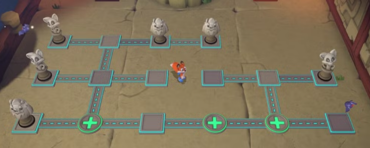
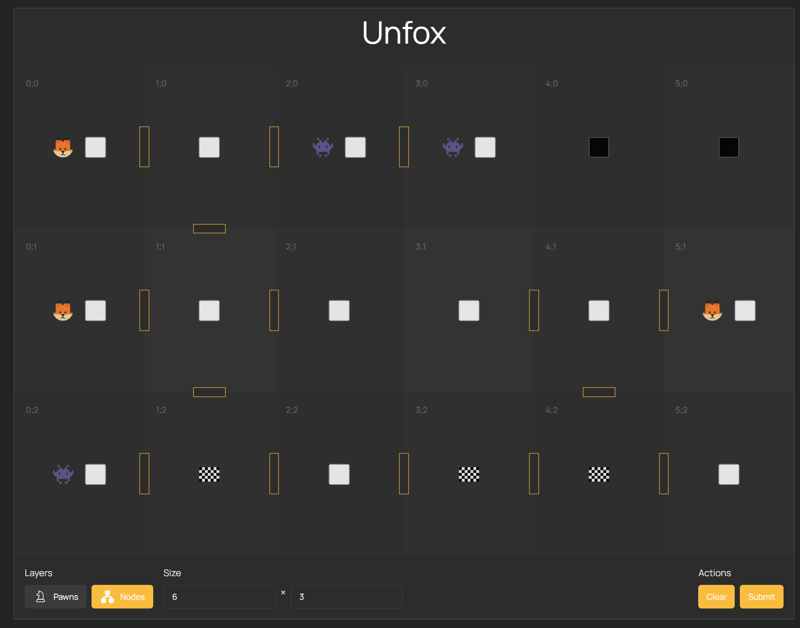
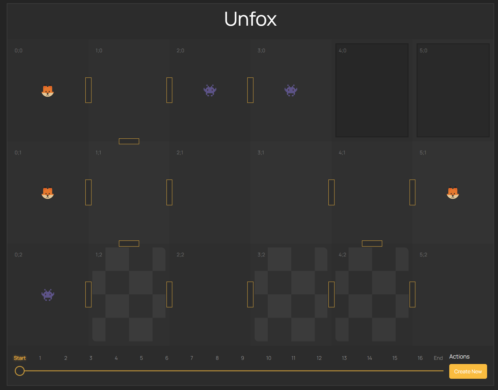

# Unfox

Unfox is a simple tool that helps resolving the puzzle levels of the games [Super Lucky's Tale](https://store.steampowered.com/app/1038300/New_Super_Luckys_Tale/) and [New Super Lucky's Tale](https://store.steampowered.com/app/1038300/New_Super_Luckys_Tale/).

## Project assumptions

I'm using Rust for backend and Svelte for frontend. Backend accept puzzle level as a JSON object and try to resolve it. If the solution is found, it returns a list of steps to solve the puzzle. Frontend allows to input puzzle level and show the solution as a list of steps. Backend can solve only single puzzle level at once.

Level solving uses the BFS (Breadth-First Search) algorithm. It's not the most efficient algorithm, but it's simple and works well for this kind of problem - there are no many possible moves in the puzzle level. Thanks to that, we also can find the shortest path from the starting point to the end point.

This algorithm works like follows:
1. We start from the starting point and add it to the queue.
2. We take the first element from the queue and check all possible moves from this point.
3. If the move is valid and we haven't visited this point yet, we add it to the queue.
4. If the move satisfies the end point, we have found the solution - done!
5. Otherwise we repeat the process until we reach the end point.

We have a puzzle level, where we have to move foxes from the starting points to the goal points. The fox can move in four directions: up, down, left, right. The fox can't move through the walls or others pawns. The goal is to find the shortest path from the starting point to the end point using other pawns (monsters and foxes) as a needed obstacles.

I'm using Rust for backend and Svelte for frontend - there are no any particular reasons for that. I just wanted to use these technologies. I know that I could done problem-solving also in JavaScript and keep the whole project in one language, but that's not the point of this project.

## The problem

The puzzle level looks like this:

- We have to move all foxes to the goal points (pluses)
- Each pawn can move in four directions: up, down, left, right
- Pawns moves until they reach the wall or another pawn
- Monsters positions does not matter for the solution
- Very often pawns helps to block the way for other pawns

We have to rewrite the puzzle using GUI hosted by the Rust server. Puzzle level will be interpreted as a grid. Each cell is described by following fields:

- `type` - type of the cell:
  - `wall` - obstacle,
  - `empty` - something can be moved there,
  - `goal` - like `empty` but also the goal point,
- `pawn` - type of the pawn:
  - `fox` - the pawn we have to move,
  - `monster` - the pawn that blocks the way,
  - `null` - no pawn in this cell,
- `direction` - edges between this and other nodes, written as a number - binary flags, where each bit represents the direction. Thanks to that we can easily check if we can move from one cell to another.

After rewritting the puzzle, level in the GUI will looks like this:

As you can see, we decided about the grid size, nodes, edges and pawns. Now we can click the `Submit` button to find the solution.

This example requires **16** steps (with **4052** possible branches at the end) to solve the puzzle. The solution looks like this:

Using bottom bar we can look at the each step of the solution, back and forth. Solution preview shows us on the each step, where the pawns have to be moved to achieve the goal. Each steps shows us only move of the single pawn in single direction.

## How to run the project

To run the project, you need to have installed Rust and Node.js.

1. Clone the repository
2. In the root directory run `cargo run` - This will start the Rust server and try to install the frontend dependencies, build the frontend and start the frontend server and bind results to the public directory in the root directory

For development purposes, you can run the backend and frontend separately.
- `cargo run` with `RUST_NO_GUI=1` in the root directory - This will start the backend server without trying to recreate the frontend
- `npm i && npm run dev` in the `gui` directory - This will start the frontend server and bind results to the public directory in the root directory